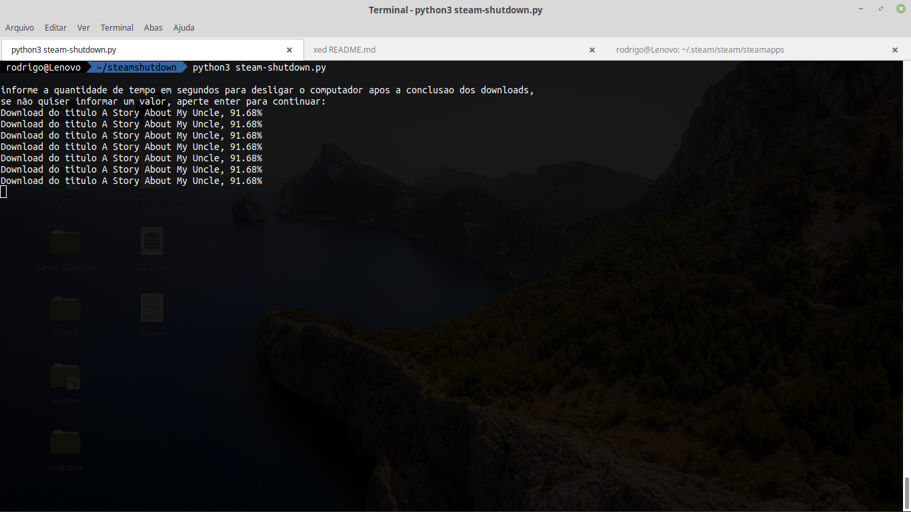

Antes de tudo este é um projeto que vem absolutamente sem garantia alguma também não é um projeto official, 
apenas um meio de contornar um problema que há tempos não vi uma solução para o sistema Linux e graças ao 
trabalho do usuário leovp esta solucão foi possivel.

Antes de começar a usar o script são necessários alguns requsitos:

* Python 3.3+ instalado na máquina
* steamfiles - biblioteca python que possibilitou este script
 
para instalar o steam files sugiro utilizar o pip da seguinte maneira:

pip3 install steamfiles 

#obs: minha distro tem varias versões do python não sei se funciona sem indicar o número do pip

após instalado steam files inicie a steam e comece o download do titulo desejado em seguida
inicie o script da seguinte maneira:$ python3 steam-shutdown.py

ao iniciar o script será solicitado ao usuário um tempo em segundos para indicar quanto tempo após o download
computador deverá desligar, essa função foi criada pensando na integridade dos dados a serem gravados no disco
visando não corromper o download desligando abruptamente após o término do download, se não for informado um 
valor 60 segundos serão assumidos como valor padrão para o desligamento do computador, após o script verifica
se há algum download na fila, se houver na sua linha de comando você verá uma pequena descrição com o 
nome do jogo e a porcentagem em que ele se encontra e quando o download for finalizado o script encerra o computador,
se não houver nenhum jogo para baixar é exibida uma mensagem e o script é encerrado

OBS: esse script foi criado tendo em mente que você possui acesso a conta de administrador do sistema, se você
não possui acesso a essa conta o script não funcionará conforme planejado, pois só a conta root tem acesso para
desligar o computador.

Créditos: [leovp](https://github.com/leovp/)
